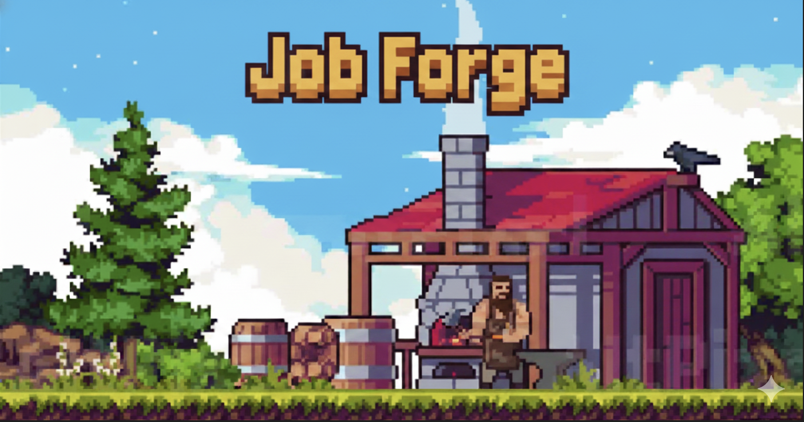

# Job-Forge



An intelligent, LLM-powered CV & job-matching assistant. Paste a job offer, get an ATS-optimized tailored resume — all running locally in your browser.

## Features

- **Job analysis** — paste a URL or job description text; AI extracts mandatory and nice-to-have skills
- **Skill matching** — compares job requirements against your profile skills with levels
- **Tailored CV generation** — streams a complete, ATS-optimized resume in real time
- **PDF export** — downloads a clean, ATS-friendly PDF (selectable text, no graphics)
- **Missing skills guide** — practical learning suggestions for skills you don't have yet
- **Job dashboard** — tracks all analyzed jobs with application statuses
- **Profile import** — upload your existing CV (PDF) and let AI parse it into your profile
- **Multi-provider LLM** — Anthropic Claude, Google Gemini, Ollama (local), or any OpenAI-compatible proxy

## Getting Started

### Prerequisites

- Node.js 18+
- An API key for your preferred LLM provider, or a running [Ollama](https://ollama.ai) instance

### Install & run

```bash
npm install
npm run dev
```

Open [http://localhost:5173](http://localhost:5173).

### Run with Docker

Build the image:

```bash
docker build -t job-forge .
```

Run the container:

```bash
docker run --rm -p 8080:80 job-forge
```

Open [http://localhost:8080](http://localhost:8080).

This container uses a multi-stage build (`node:20-alpine` -> `nginx:alpine`) and includes SPA routing support so React Router paths work on refresh.

### First-time setup

1. **Settings** — select your LLM provider, enter your API key (or Ollama base URL), and click **Test Connection**
2. **My Profile** — fill in your skills, experience, education, and projects — or click **Import from PDF** to parse your existing CV
3. **Analyze Job** — paste a job URL or description and let the AI do the work

## Tech Stack

| Layer | Library |
|---|---|
| Framework | TypeScript + Vite + React 19 |
| LLM | [Vercel AI SDK](https://sdk.vercel.ai) (`ai`, `@ai-sdk/anthropic`, `@ai-sdk/google`, `ollama-ai-provider`) |
| Database | [Dexie.js](https://dexie.org) v4 (IndexedDB) |
| State | [Zustand](https://zustand-demo.pmnd.rs) v5 |
| Routing | React Router v7 |
| Forms | React Hook Form + Zod |
| UI | Tailwind CSS v4 + shadcn/ui (Radix primitives) |
| PDF export | [@react-pdf/renderer](https://react-pdf.org) v4 |
| PDF import | [pdfjs-dist](https://mozilla.github.io/pdf.js) v5 |

## Supported LLM Providers

| Provider | Notes |
|---|---|
| **Anthropic Claude** | Recommended — `claude-sonnet-4-6` or `claude-opus-4-6` |
| **Google Gemini** | `gemini-2.0-flash` or `gemini-1.5-pro` |
| **Ollama** | Local open-source models; set base URL to `http://localhost:11434/api` |
| **Custom Proxy** | Any OpenAI-compatible endpoint; configure base URL + optional API key |

## Data & Privacy

All data is stored **locally in your browser**:

- **IndexedDB** — your profile (skills, experience, education, projects) and job analysis history
- **localStorage** — LLM provider settings and API key

Nothing is sent to any server except the LLM API calls you configure. Export/import your full profile as JSON from the Settings page.

## Project Structure

```
src/
├── types/              TypeScript interfaces (profile, job, settings)
├── lib/
│   ├── db/             Dexie schema + CRUD helpers
│   ├── llm/            Provider factory, streaming client, Zod schemas, system prompts
│   ├── pdf/            react-pdf CV document template + download helper
│   └── utils/          Skill matcher, job URL fetcher, PDF text extractor
├── store/              Zustand stores (profile, jobs, settings)
├── components/
│   ├── ui/             shadcn/ui primitives
│   ├── layout/         AppShell, Sidebar, Header
│   ├── job/            JobInput, SkillList, SkillCard, JobAnalysisResult
│   ├── cv/             CVEditor, CVPreview, ExperienceEditor
│   ├── profile/        SkillsManager
│   └── settings/       LLMProviderConfig
└── pages/              Dashboard, Profile, NewJob, JobAnalysis, Settings
```

## Scripts

```bash
npm run dev       # Start dev server
npm run build     # Production build
npm run preview   # Preview production build
npm run lint      # ESLint
```

## Notes

- **URL fetching** uses `api.allorigins.win` as a CORS proxy by default. For many job sites this works; for others, **paste the description text** directly.
- The PDF library (`@react-pdf/renderer`) adds ~1.5 MB to the bundle — this is expected and normal.
